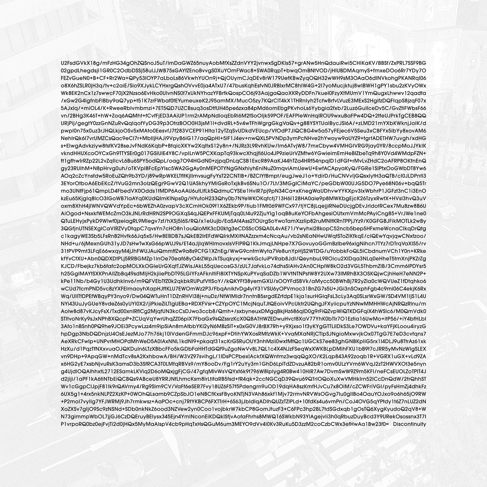

# Discontinuity



## Album Artwork Decryption Guide

This repository contains the encrypted text featured on the album cover for *Discontinuity* by Yann Novak.

To decrypt it:

1. Visit: [https://encrypt-online.com/decrypt](https://encrypt-online.com/decrypt)
2. Select **AES-256-CBC (legacy compatibility)** as the encryption method
3. Paste the contents of `encrypted-text.txt` into the input field
4. Use the album title — **`Discontinuity`** (capital <kbd>D</kbd>) — as the passphrase
5. Click **Decrypt**

> [!WARNING]
> Make sure to copy the encrypted text **exactly**, with no extra spaces or line breaks.

## Files

- `encrypted-text.txt`: The raw AES-encrypted string extracted from the album cover
- `cover.jpg` – Full-size album cover image (high resolution)
- `thumbnail.jpg` – Reduced-size image used for preview in this README

## Listen or Buy

- **Bandcamp**: [Buy or stream on Bandcamp](https://yannnovak.bandcamp.com/album/discontinuity)
- **Label**: [Room40](https://room40.org)

## About the Project

The album cover for *Discontinuity* contains an encrypted resource guide for private communication and online communication that compliments the albums concept. This guide allows fans to decrypt it without the hurdles of copying text from a JPG.

## Project Structure
```
discontinuity/
├── assets/
│   ├── cover.jpg
│   └── thumbnail.jpg
├── README.md
└── encrypted-text.txt
```